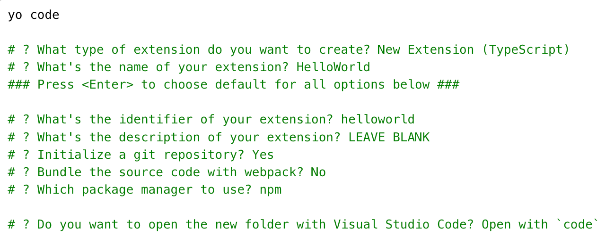
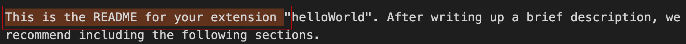
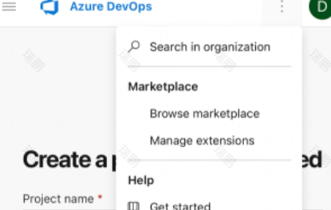
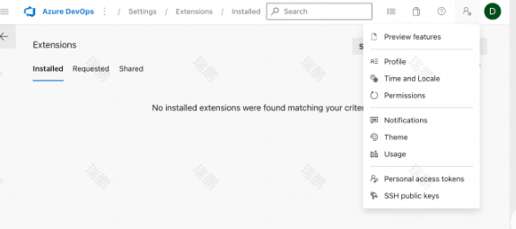
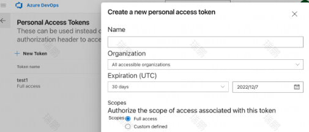

# vscode插件开发步骤
参考链接
[官方文档](https://code.visualstudio.com/api/get-started/your-first-extension)
[中文文档](https://www.bookstack.cn/read/CN-VScode-Docs/md-%E5%B7%A5%E5%85%B7-vse%E5%91%BD%E4%BB%A4%E8%A1%8C%E5%B7%A5%E5%85%B7.md)

## 准备工作
1、安装拓展生成器

 - `npm install -g yo generator-code`

2、初始化生成器  

 - `yo code` 
  

## 运行  

 - <kbd>fn</kbd>+<kbd>F5</kbd>，会打开新的窗

 - <kbd>⇧</kbd><kbd>⌘</kbd><kbd>P</kbd>，输入Hello World执行插件，右下角会出现“Hello World from HelloWorld!”提示
  
## 修改后运行
 - 运行developer:Reload Window重新加载窗口，重新执行Hello World之前修改的会生效
  
## 打包
 - `vsce package`
 - 如果提示
就把READ.md中，这些关键词去掉，因为包里是对这些关键词做了校验

## 发布
主要介绍如何获取Personal Access Token,其余的发布流程参考[该文档](https://www.bookstack.cn/read/CN-VScode-Docs/md-%E5%B7%A5%E5%85%B7-vse%E5%91%BD%E4%BB%A4%E8%A1%8C%E5%B7%A5%E5%85%B7.md)
 - 如果没有加入组织，需要先创建组织
 - 选择Manage extensions
 - 选择Personal Access Token
 - 点击+号进行创建